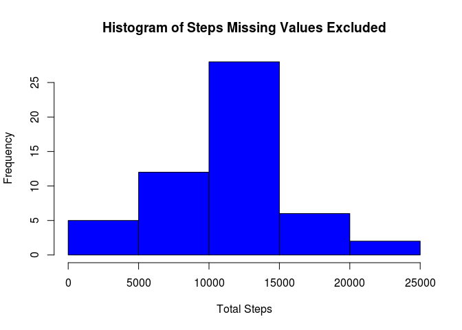
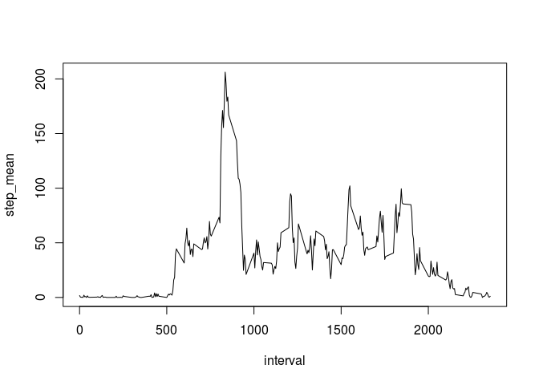
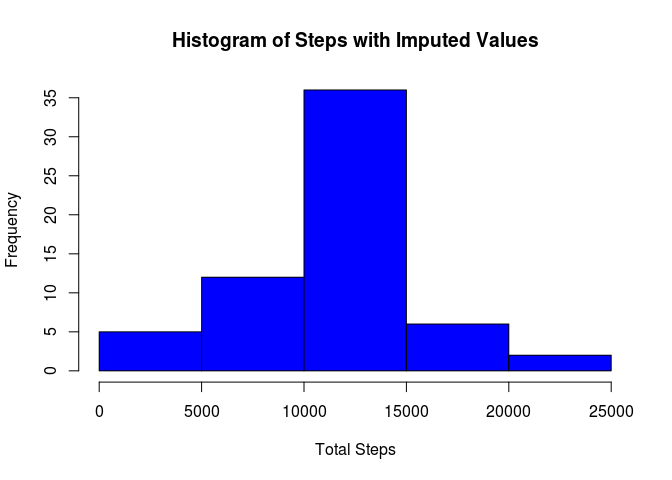
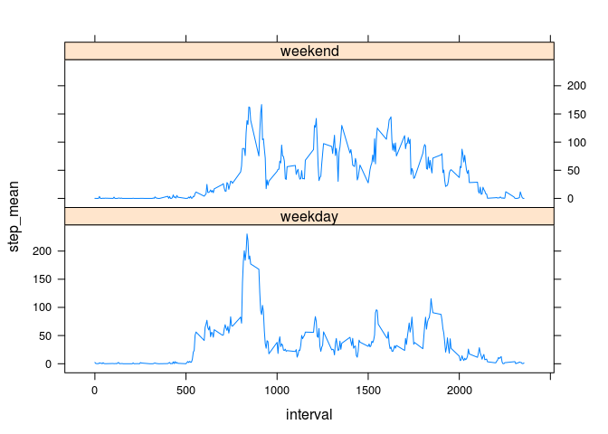

# Reproducible Research: Peer Assessment 1

## Introduction

It is now possible to collect a large amount of data about personal
movement using activity monitoring devices such as a
[Fitbit](http://www.fitbit.com), [Nike
Fuelband](http://www.nike.com/us/en_us/c/nikeplus-fuelband), or
[Jawbone Up](https://jawbone.com/up). These type of devices are part of
the "quantified self" movement -- a group of enthusiasts who take
measurements about themselves regularly to improve their health, to
find patterns in their behavior, or because they are tech geeks. But
these data remain under-utilized both because the raw data are hard to
obtain and there is a lack of statistical methods and software for
processing and interpreting the data.

This assignment makes use of data from a personal activity monitoring
device. This device collects data at 5 minute intervals through out the
day. The data consists of two months of data from an anonymous
individual collected during the months of October and November, 2012
and include the number of steps taken in 5 minute intervals each day.

## Data

The data for this assignment was downloaded from thecourse website:

* Dataset: [Activity monitoring data](https://d396qusza40orc.cloudfront.net/repdata%2Fdata%2Factivity.zip) [52K]

The variables included in this dataset are:

* **steps**: Number of steps taking in a 5-minute interval (missing
    values are coded as `NA`)

* **date**: The date on which the measurement was taken in YYYY-MM-DD
    format

* **interval**: Identifier for the 5-minute interval in which
    measurement was taken

The dataset is stored in a comma-separated-value (CSV) file and there
are a total of 17,568 observations in this
dataset.

## Loading and preprocessing the data

If the .csv does not exist unzip from the .zip archive.  It is assumed that the file is in the current directory for this assignment.  No material preprocessing was required to load the data set.


```r
library(data.table)

if(!file.exists("activity.csv")){
    unzip('activity.zip')
}

activityData <- data.table(read.csv("activity.csv"))
```


## What is mean total number of steps taken per day?

The following data table answers the question about the mean steps per day.

```r
totalStepsByDay <- activityData[complete.cases(activityData),.(total_steps=sum(steps)),by=.(date)]
totalStepsByDay
```

```
##           date total_steps
##  1: 2012-10-02         126
##  2: 2012-10-03       11352
##  3: 2012-10-04       12116
##  4: 2012-10-05       13294
##  5: 2012-10-06       15420
##  6: 2012-10-07       11015
##  7: 2012-10-09       12811
##  8: 2012-10-10        9900
##  9: 2012-10-11       10304
## 10: 2012-10-12       17382
## 11: 2012-10-13       12426
## 12: 2012-10-14       15098
## 13: 2012-10-15       10139
## 14: 2012-10-16       15084
## 15: 2012-10-17       13452
## 16: 2012-10-18       10056
## 17: 2012-10-19       11829
## 18: 2012-10-20       10395
## 19: 2012-10-21        8821
## 20: 2012-10-22       13460
## 21: 2012-10-23        8918
## 22: 2012-10-24        8355
## 23: 2012-10-25        2492
## 24: 2012-10-26        6778
## 25: 2012-10-27       10119
## 26: 2012-10-28       11458
## 27: 2012-10-29        5018
## 28: 2012-10-30        9819
## 29: 2012-10-31       15414
## 30: 2012-11-02       10600
## 31: 2012-11-03       10571
## 32: 2012-11-05       10439
## 33: 2012-11-06        8334
## 34: 2012-11-07       12883
## 35: 2012-11-08        3219
## 36: 2012-11-11       12608
## 37: 2012-11-12       10765
## 38: 2012-11-13        7336
## 39: 2012-11-15          41
## 40: 2012-11-16        5441
## 41: 2012-11-17       14339
## 42: 2012-11-18       15110
## 43: 2012-11-19        8841
## 44: 2012-11-20        4472
## 45: 2012-11-21       12787
## 46: 2012-11-22       20427
## 47: 2012-11-23       21194
## 48: 2012-11-24       14478
## 49: 2012-11-25       11834
## 50: 2012-11-26       11162
## 51: 2012-11-27       13646
## 52: 2012-11-28       10183
## 53: 2012-11-29        7047
##           date total_steps
```

Plot histogram for the total steps by day.

```r
hist(totalStepsByDay$total_steps,col="blue",xlab="Total Steps",main="Histogram of Steps Missing Values Excluded")
```



Calculate the mean and median total steps per day.

```r
mean(totalStepsByDay$total_steps)
```

```
## [1] 10766.19
```

```r
median(totalStepsByDay$total_steps)
```

```
## [1] 10765
```

## What is the average daily activity pattern?


```r
meanStepsByInterval <- activityData[complete.cases(activityData),.(step_mean=mean(steps)),by=.(interval)]
```

```r
plot(meanStepsByInterval,type='l')
```



The interval that has the maximum number of steps on average is:

```r
meanStepsByInterval[step_mean==max(meanStepsByInterval$step_mean),]$interval
```

```
## [1] 835
```

## Imputing missing values

Missing values can have an impact on the analysis.  In this data set we are missing step data for 2304 intervals.


```r
colSums(is.na(activityData))
```

```
##    steps     date interval 
##     2304        0        0
```

In this data set, I've imputed the number of steps for missing values by using the mean steps by interval.  Since the original data ws integer and the mean is not, steps were first converted to numeric.  Then the data table updated for all NA values with the mean for the day.


```r
imputeAD<-activityData
#convert to numeric
imputeAD$steps<-as.numeric(imputeAD$steps)
#impute step mean and update data table
imputeAD[is.na(steps),]$steps <- meanStepsByInterval[interval==activityData[is.na(steps),]$interval,step_mean]
```

Histogram showing steps with imputed values.

```r
#create histogram of steps
hist(imputeAD[,sum(steps),by=date]$V1,col="blue",main="Histogram of Steps with Imputed Values", xlab="Total Steps")
```



The mean and median are calculated again to see if imputing values have any effect on the data set.

Mean and median with imputed values:

```r
mean(imputeAD[,sum(steps),by=date]$V1)
```

```
## [1] 10766.19
```

```r
median(imputeAD[,sum(steps),by=date]$V1)
```

```
## [1] 10766.19
```

Mean and median original values:

```r
mean(totalStepsByDay$total_steps)
```

```
## [1] 10766.19
```

```r
median(totalStepsByDay$total_steps)
```

```
## [1] 10765
```

As you can see,there is no material difference.

## Are there differences in activity patterns between weekdays and weekends?
To determine if there are any differences in activity patterns between weekday and weekend.  A factor variable was added to indicate day type (weekend or weekday). 


```r
library(lubridate)
library(chron)
library(lattice)
#add factor variable for day type as weekend or weekday
imputeAD[,day_type:=factor(ifelse(is.weekend(imputeAD$date),"weekend","weekday"))]
```

```
##            steps       date interval day_type
##     1: 1.7169811 2012-10-01        0  weekday
##     2: 0.3396226 2012-10-01        5  weekday
##     3: 0.1320755 2012-10-01       10  weekday
##     4: 0.1509434 2012-10-01       15  weekday
##     5: 0.0754717 2012-10-01       20  weekday
##    ---                                       
## 17564: 4.6981132 2012-11-30     2335  weekday
## 17565: 3.3018868 2012-11-30     2340  weekday
## 17566: 0.6415094 2012-11-30     2345  weekday
## 17567: 0.2264151 2012-11-30     2350  weekday
## 17568: 1.0754717 2012-11-30     2355  weekday
```

A plot was then created to show the difference between weekend and weekday interval means.


```r
xyplot(step_mean~interval|day_type,imputeAD[,.(step_mean=mean(steps)),by=.(interval,day_type)], type='l',layout=c(1,2))
```



As you can see on weekdays it appears that there were fewer steps taken in the middle of the day when people are typically working.
